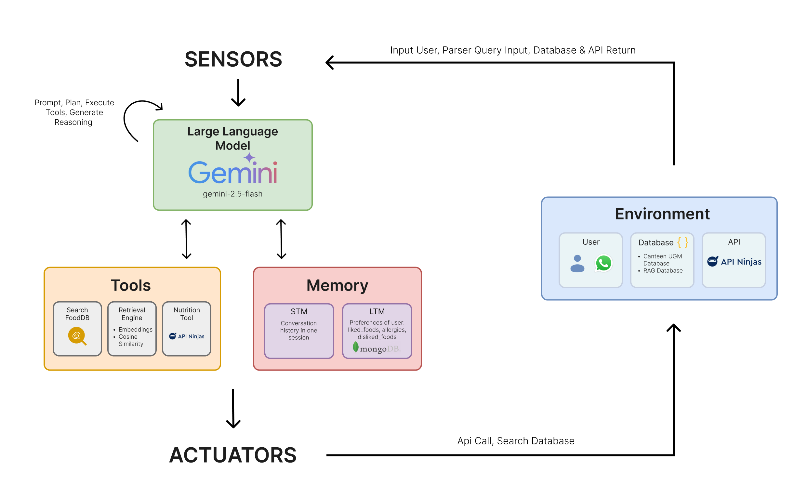

# Kencot Bot - Mamang UGM 🤖🍽️

Kencot Bot adalah chatbot WhatsApp **teman terbaikmu saat kencot (lapar berat)** di sekitar kampus UGM. Cukup chat "laper", dan Mamang UGM akan menanyakan lokasi, tingkat kelaparan, dan budget-mu untuk memberikan **rekomendasi makanan paling mantul**.

Didesain dengan bahasa **Gen Z**, bot ini bikin percakapan santai tapi tetap cerdas.

---

## Nama Tim
| No | Nama                        | NIM                |
|----|-----------------------------|--------------------|
| 1  | Adinda Putri Romadhon       | 22/505508/TK/55321 |
| 2  | Fatimah Nadia Eka Putri     | 22/497876/TK/554588|

---

## Link
- **Demo Video:**
  - [https://bit.ly/VideoDemoKencot-Bot](https://bit.ly/VideoDemoKencot-Bot)

- **Link PPT:**
  - [PDF PPT Presentasi](https://drive.google.com/file/d/1KkjctXrmL1yCzlNhx7YkXp80rip9fY7a/view?usp=sharing)
  - [PPT Presentasi](https://docs.google.com/presentation/d/14aagyh5VrmLZ-b4oezT8jvQyUHmKAQV5/edit?usp=sharing&ouid=110910143854406637416&rtpof=true&sd=true)

- **Demo GIF:**

    

## Fitur Utama

* **Rekomendasi Cerdas**: Disesuaikan dengan lokasi (fakultas), tingkat kelaparan, dan budget.
* **Database Kantin UGM**: Lengkap dengan kantin populer di sekitar kampus.
* **Santai & Seru**: Bahasa Gen Z yang bikin interaksi nggak kaku.
* **Mudah Digunakan**: Chat langsung di WhatsApp seperti ngobrol biasa.

---

## Arsitektur Proyek

Bot ini menggunakan **arsitektur hybrid** yang efisien:

1. **Backend (Python & Flask)**: Otak bot yang memproses pesan dan mencari rekomendasi dari database.
2. **Konektor (Node.js & whatsapp-web.js)**: Jembatan yang menghubungkan WhatsApp ke backend API.
3. **Integrasi LLM (Gemini)**: Return rekomendasi dari AI Gemini jika tidak ada data yang sesuai dari database.



---

## Setup & Run

### 1. Clone Repository

```bash
git clone https://github.com/fatimahnadiaekaputri/kencot-bot.git
cd kencot-bot
```

### 2. Konfigurasi `.env`

Buat file `.env` di folder utama. Tidak perlu token khusus untuk WhatsApp. `.env` digunakan untuk token API GEMINI yang bisa didapatkan di [Google AI Studio](https://aistudio.google.com/)

```bash
GEMINI_API_KEY=YOUR_GEMINI_API_KEY
```

### 3. Setup Backend Python (CLI)

```bash
# Buat virtual environment
python -m venv .venv

# Aktifkan virtual environment
# Windows (PowerShell)
.\.venv\Scripts\Activate.ps1
# Mac/Linux
source .venv/bin/activate

# Install dependencies
pip install -r requirements.txt
```

#### Jalankan Backend

```bash
python main.py
```

> API server aktif di `http://localhost:5000`.

### 4. Setup Konektor WhatsApp

```bash
cd whatsapp-connector
npm install
```

#### Jalankan Konektor

```bash
npm run dev
```

> Scan QR code via WhatsApp saat pertama kali.
> Bot **ONLINE** dan siap digunakan.

---

## Cara Menggunakan (CLI / WhatsApp)

1. Chat bot WhatsApp.
2. Mulai dengan kata kunci: `laper`, `makan`, atau `rekomen`.
3. Jawab pertanyaan bot: lokasi, tingkat kelaparan, budget.
4. Nikmati rekomendasi makanan paling mantul!

---

## Struktur Folder

```
kencot-bot/
│
├─ main.py              # Entry point backend Python
├─ requirements.txt     # Dependencies Python
├─ .env                 # Rahasia & config
├─ whatsapp-connector/  # Folder konektor Node.js
│  ├─ index.js
│  └─ package.json
├─ app/                 # Logic bot
│  ├─ bot.py
│  ├─ config.py
│  ├─ llm.py            # openai bot
│  └─ utils.py
├─ test/                # test code
│  ├─ functional_test.py           
│  └─ unit_test.py
└─ database/            # Data kantin
```

---

*Selamat mencoba! Semoga Mamang UGM siap nemenin kencot-mu setiap saat! 🤤*
