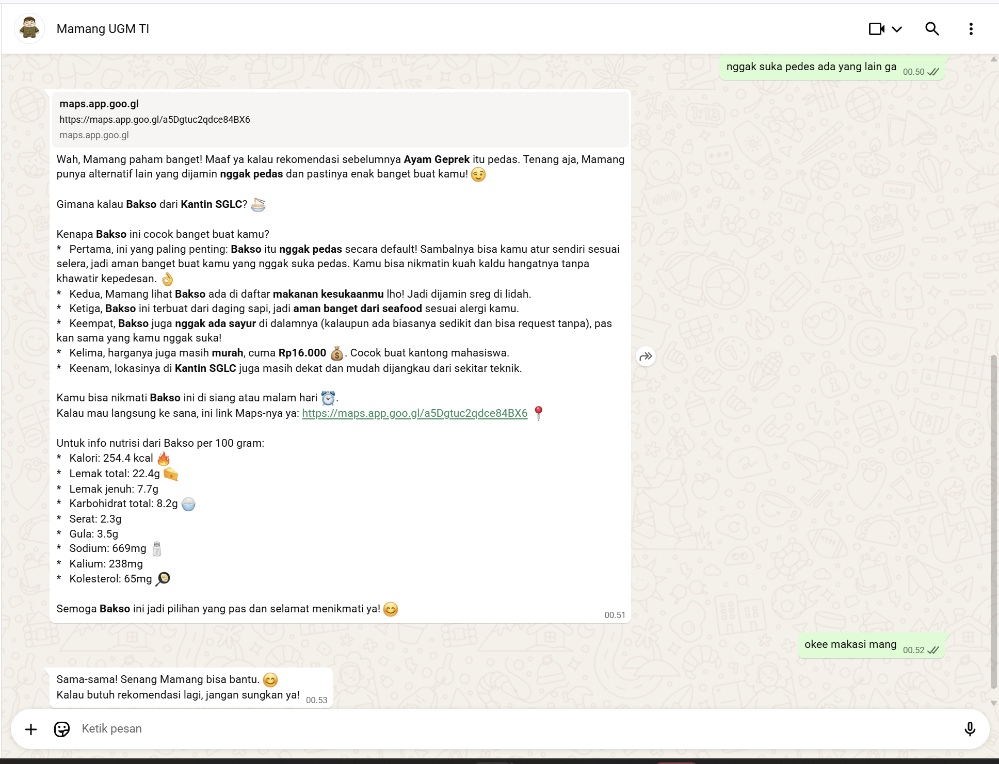

# Kencot Bot - Mamang UGM 🤖🍽️

> **Kencot Bot V2.0** — Mamang AI: Context-aware LLM Agent untuk rekomendasi makanan kampus (CLI + WhatsApp). Didesain dengan bahasa **Gen Z**, bot ini bikin percakapan santai tapi tetap cerdas.

---
Kencot Bot V2.0 adalah prototype chatbot agentic yang menggabungkan **LLM (multi-model: Groq / Gemini)**, **RAG (Retrieval-Augmented Generation)**, dan **memory (short-term & long-term)** untuk memberi rekomendasi makanan kontekstual. Bot ini punya mode **CLI** untuk testing dan integrasi **WhatsApp** (via Node.js / whatsapp-web.js) untuk demo pengguna real.

README ini berisi panduan cepat: setup, konfigurasi, cara jalanin, testing, dan tips debugging.

## Nama Tim
| No | Nama                        | NIM                |
|----|-----------------------------|--------------------|
| 1  | Adinda Putri Romadhon       | 22/505508/TK/55321 |
| 2  | Fatimah Nadia Eka Putri     | 22/497876/TK/54588|

---

## Link
- **Video presentasi:**
  - [Video Presentasi](https://drive.google.com/file/d/1XpPIqRFE3H2H2tnpxdHCFXZOe48AR2nA/view?usp=drive_link)

- **Link PPT:**
  - [PDF PPT Presentasi](https://drive.google.com/file/d/1FFHJ4dH3Lpofx1LCiidy4u-XlS8fw_w1/view?usp=sharing)
 
- **Link Notion:**
  - [Notion Report](https://gifted-rooster-06e.notion.site/Kencot-bot-V2-0-An-LLM-Powered-WhatsApp-Bot-for-Smart-Food-Recommendations-2966080924fb807bb27af28377f74892?source=copy_link)

- **Demo Screenshot:**

    

    

- **Demo GIF:**

    

## Fitur Utama

- Rekomendasi makanan berbasis konteks: fakultas, tingkat lapar, budget, waktu.
- RAG retrieval untuk mencari menu dari dataset kantin.
- Layer reasoning dengan LLM (pilih model `groq` atau `gemini`).
- Short-term memory (session) + long-term memory (personalization).
- Mode CLI untuk dev/testing, mode WhatsApp untuk demo user-facing.
- Fallback dan rule-based handler kalau LLM/GROQ/Gemini gagal.
- Lengkap dengan Database Kantin UGM
- Chat langsung di WhatsApp seperti ngobrol biasa. Bahasa Gen Z yang bikin interaksi nggak kaku.

---
## Requirement
- Python 3.10+
- Node.js 18+ (untuk whatsapp-connector)
- `pip` packages (lihat `requirements.txt`)
- Akun & API keys (Gemini) — letakkan di `.env`

---

## Arsitektur Proyek


---

## Setup & Run

### 1. Clone Repository

```bash
git clone https://github.com/fatimahnadiaekaputri/kencot-bot.git
cd kencot-bot
```

### 2. Konfigurasi `.env`

Buat file `.env` di folder utama. Tidak perlu token khusus untuk WhatsApp. `.env` digunakan untuk token API GEMINI yang bisa didapatkan di [Google AI Studio](https://aistudio.google.com/)

```bash
GEMINI_API_KEY=YOUR_GEMINI_API_KEY
```

### 3. Setup Backend Python (CLI)

```bash
# Buat virtual environment
python -m venv .venv

# Aktifkan virtual environment
# Windows (PowerShell)
.\.venv\Scripts\Activate.ps1
# Mac/Linux
source .venv/bin/activate

# Install dependencies
pip install -r requirements.txt
```

#### Jalankan Backend

```bash
python wa_server.py
```

> API server aktif di `http://localhost:5000`.

### 4. Setup Konektor WhatsApp

```bash
cd whatsapp-connector
npm install
```

#### Jalankan Konektor

```bash
npm run dev
```

> Scan QR code via WhatsApp saat pertama kali.
> Bot **ONLINE** dan siap digunakan.

---

## Cara Menggunakan (CLI / WhatsApp)

```bash
python -m main --cli
```

---

## Struktur Singkat Repo
```
kencot-bot-v2.0/
├─ src/
│  ├─ bot/
│  ├─ llm/
│  ├─ rag/
│  ├─ memory/
│  ├─ database/
│  └─ utils/
├─ whatsapp-connector/
│  └─ index.js
├─ data/
├─ tests/
├─ requirements.txt
├─ .env.example
├─ main.py
├─ wa_server.py
└─ README.md
```

---

*Selamat mencoba! Semoga Mamang UGM siap nemenin kencot-mu setiap saat! 🤤*
